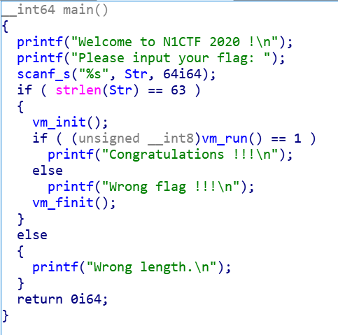
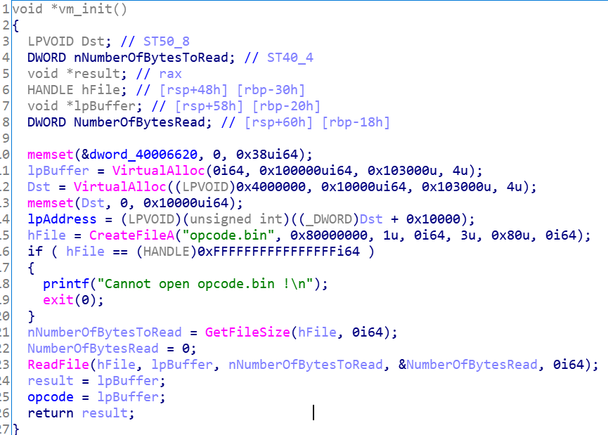
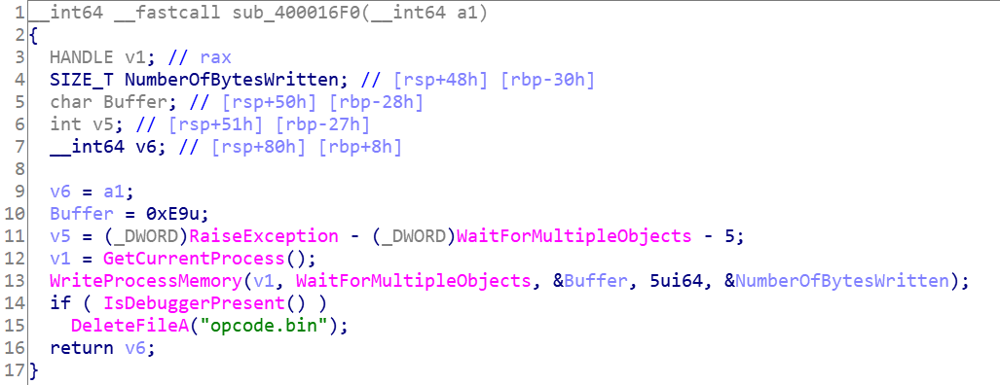
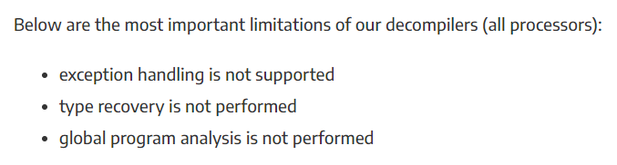
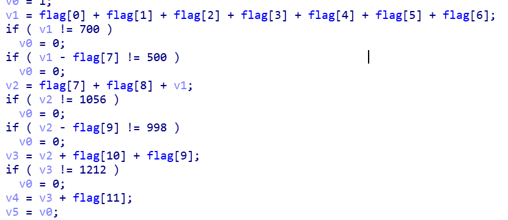

## easyre

flag长度是63



在vm_init中申请内存读入opcode并初始化了寄存器和内存.



在vm_finit中释放了申请的内存空间


查看vm_run发现看不到全部伪代码


查看initterm的函数项,发现一个可疑函数



这个函数hook了WaitForMultipleObjects,还有一个简单的反调试

核心代码在vm_run中,但是ida pro的decompiler不能反编译exception handling



https://www.hex-rays.com/products/decompiler/manual/limit.shtml

这里我创建了一个新的段,然后将exception handling  patch到这个段,将每一个exception handling创建一个函数来查看伪代码的.

根据伪代码写出虚拟机指令的反汇编脚本:

```python
import binascii

rip = 0
f=open('opcode.bin','rb')
t=f.read()
opcode=[((t[i+3]<<24)|(t[i+2]<<16)|(t[i+1]<<8)|t[i]) for i in range(0,len(t),4)]

opcode_type_id = [0x1000000, 0x2000000, 0x3000000, 0x6000000, 0x5000000, 0x4000000,
                  0x7000000, 0x8000000, 0x9000000, 0x0B000000, 0x0C000000, 0x0A000000]

tot=0
tag=3

while rip != len(opcode):
    opcode_type = opcode[rip] & 0xF000000
    opcode_a1 = opcode[rip] & 0xFFF000
    opcode_a2 = opcode[rip] & 0xFFF
    arg1 = opcode[rip+1]
    arg2 = opcode[rip+2]
    
    if tag==2:
        print("LABLE_%d:"%tot)
        tot+=1

    if opcode_type == opcode_type_id[0]:
        if opcode_a1 == 0x800000:
            if opcode_a2==0x900:
                print('memory[ %s + 0x100 ] = %s;'%(hex(arg1),hex(arg2)))
            
            elif opcode_a2==0x100:
                print('reg_1 = %s;'%(hex(arg1)))
            
            elif opcode_a2==0x400:
                print('reg_3 = %s;'%(hex(arg1)))

        elif opcode_a1 == 0x900000:
            if opcode_a2==0x100:
                print('reg_1 = memory[ %s + 0x100 ];'%(hex(arg1)))
            
            elif opcode_a2==0x400:
                print('reg_3 = memory[ %s + 0x100 ];'%(hex(arg1)))

        elif opcode_a1 == 0x101000:
            if opcode_a2==0x900:
                print('memory[ %s + 0x100 ] = (unsigned char)reg_1;'%(hex(arg1)))
            
            elif opcode_a2==0x700:
                if arg1==1:
                    print('*(unsigned char *)reg_3 = (unsigned char)reg_1;')

                elif arg1==2:
                    print('*(unsigned char *)reg_1 = (unsigned char)reg_1;')

        elif opcode_a1 == 0x401000:
            if opcode_a2==0x700:
                if arg1==1:
                    print('*(unsigned char *)reg_3 = (unsigned char)reg_3;')
                
                elif arg1==2:
                    print('*(unsigned char *)reg_1 = (unsigned char)reg_3;')

        elif opcode_a1 == 0x400000:
            if opcode_a2==0x300:
                print('reg_2 = reg_3;')
            elif opcode_a2==0x100:
                print('reg_1 = reg_3;')

        elif opcode_a1 == 0xA00000:
            print('reg_3 = %s + reg_1;'%(hex(arg1)))

    elif opcode_type==opcode_type_id[1]:
        if opcode_a1==0x800000:
            if opcode_a2==0x100:
                print('reg_1 += %s;'%(hex(arg1)))
                
            elif opcode_a2==0x400:
                print('reg_3 += %s;'%(hex(arg1)))

        elif opcode_a1==0x100000:
            if opcode_a2==0x400:
                print('reg_3 += reg_1;')

        elif opcode_a1==0x400000:
            if opcode_a2==0x100:
                print('reg_1 += reg_3;')

    elif opcode_type==opcode_type_id[2]:
        if opcode_a1==0x100000:
            if opcode_a2==0x400:
                print('reg_3 -= reg_1;')

    elif opcode_type==opcode_type_id[3]:
        if opcode_a1==0x700000:
            if arg1==1:
                if opcode_a2==0x100:
                    print('reg_1 = *(unsigned char *)(reg_1 + %s);'%(hex(arg2)))
            elif arg1==2:
                if opcode_a2==0x400:
                    print('reg_3 = *(unsigned char *)reg_3;')
        
        elif opcode_a1==0x101000:
            if opcode_a2==0x400:
                print('reg_3 = (unsigned char)reg_1;')
            
            elif opcode_a2==0x100:
                print('reg_1 = (unsigned char)reg_1;')
            
        
        elif opcode_a1==0x401000:
            if opcode_a2==0x100:
                print('reg_1 = (unsigned char)reg_3;')
            elif opcode_a2==0x400:
                print('reg_3 = (unsigned char)reg_3;')


    elif opcode_type==opcode_type_id[4]:
        if opcode_a1==0x800000:
            if opcode_a2==0x401:
                print('tmp = (unsigned char*)&reg_3; *tmp >>= 4;')
    
    elif opcode_type==opcode_type_id[5]:
        if opcode_a1==0x800000:
            if opcode_a2==0x400:
                print('reg_3 <<= 4;')

    elif opcode_type==opcode_type_id[6]:
        if opcode_a1==0x300000:
            if opcode_a2==0x400:
                print('reg_3 |= reg_2;')

    elif opcode_type==opcode_type_id[7]:
        if opcode_a1==0x900000:
            if opcode_a2==0x101:
                print('tmp = (unsigned char*)&reg_1; *tmp ^= memory[ %s + 0x100 ];'%(hex(arg1)))
    
    elif opcode_type==opcode_type_id[8]:
        if opcode_a1==0x800000:
            if opcode_a2==0x100:
                print('eflag = reg_1 - %s;'%(hex(arg1)))
    
    elif opcode_type==opcode_type_id[9]:
        tmp = opcode_type_id[arg1]
        opcode_type_id[arg1] = opcode_type_id[arg2]
        opcode_type_id[arg2] = tmp

        #print('swap SCOPE_TABLE[ %d ] , SCOPE_TABLE[ %d ]'%(arg1,arg2))

    elif opcode_type==opcode_type_id[10]:
        if arg1==1:
            print('goto xxx')
        else:
            print('if(!eflag) goto LABLE_%d;'%tot)
        
        tag=0

    elif opcode_type==opcode_type_id[11]:
        print('ret reg_1 == 1;')

    rip += 3
    tag += 1

```

查看0x40006660这个地址发现是flag的地址,将0x40006660全部替换成(unsigned int)&flag即可

代码分为两部分,一部分是加密,另一部分是检验加密后的结果


分析检验部分

反汇编脚本输出是类C语言的语法格式,可以编译成更好阅读的形式.



得到一些表达式

```
flag[0]+flag[1]+flag[2]+flag[3]+flag[4]+flag[5]+flag[6]==700
flag[0]+flag[1]+flag[2]+flag[3]+flag[4]+flag[5]+flag[6]-flag[7]==500
flag[0]+flag[1]+flag[2]+flag[3]+flag[4]+flag[5]+flag[6]+flag[7]+flag[8]==1056
flag[0]+flag[1]+flag[2]+flag[3]+flag[4]+flag[5]+flag[6]+flag[7]+flag[8]-flag[9]==998
flag[0]+flag[1]+flag[2]+flag[3]+flag[4]+flag[5]+flag[6]+flag[7]+flag[8]+flag[9]+flag[10]==1212
flag[0]+flag[1]+flag[2]+flag[3]+flag[4]+flag[5]+flag[6]+flag[7]+flag[8]+flag[9]+flag[10]+flag[11]==1467
flag[0]+flag[1]+flag[2]+flag[3]+flag[4]+flag[5]+flag[6]+flag[7]+flag[8]+flag[9]+flag[10]+flag[11]-flag[12]==1279
....
....
....
flag[0]+flag[1]+flag[2]+flag[3]+flag[4]+flag[5]+flag[6]+flag[7]+flag[8]+flag[9]+flag[10]+flag[11]+flag[12]+flag[13]+flag[14]+flag[15]+flag[16]+flag[17]+flag[18]+flag[19]+flag[20]+flag[21]+flag[22]+flag[23]+flag[24]+flag[25]+flag[26]+flag[27]+flag[28]+flag[29]+flag[30]+flag[31]+flag[32]+flag[33]+flag[34]+flag[35]+flag[36]+flag[37]+flag[38]+flag[39]+flag[40]+flag[41]+flag[42]+flag[43]+flag[44]+flag[45]+flag[46]+flag[47]+flag[48]+flag[49]+flag[50]+flag[51]+flag[52]+flag[53]+flag[54]+flag[55]+flag[56]+flag[57]+flag[58]+flag[59]+flag[60]+flag[61]==7134

```

使用z3解出值

```
[0x6e,0x31,0x63,0x74,0x66,0x7b,0x65,0xc8,0x9c,0x3a,0x62,0xff,0xbc,0x3d,0x6e,0xfb,0xde,0x1b,0x58,0x99,0xcc,0x2a,0x6f,0x8a,0x7f,0x0a,0x52,0x49,0x1d,0x22,0x76,0x8b,0x7f,0x18,0x47,0xf9,0xed,0x29,0x6d,0x2b,0xbf,0x03,0x44,0x4a,0xde,0x37,0x68,0xe9,0x1d,0x37,0x7e,0xfb,0xbe,0x1b,0x49,0xe8,0xdd,0x3d,0x74,0x3b,0x4f,0x5a,0x7d]
```

分析加密部分,发现有循环展开,优化得到代码

```
for (int i = 0; i < 31; i++)
{
	if (i % 2 == 0)
	{
		flag[i * 2] = ((flag[i * 2] & 0xf0) >> 4) | ((flag[i * 2] & 0xf) << 4);
		flag[i * 2] ^= a;
		a = flag[i * 2];
		flag[(i * 2) + 1] ^= b;
		b = flag[(i * 2) + 1];
	}
	else
	{
		flag[i * 2] ^= b;
		b = flag[i * 2];
		flag[(i * 2) + 1] = ((flag[(i * 2) + 1] & 0xf0) >> 4) | ((flag[(i * 2) + 1] & 0xf) << 4);
		flag[(i * 2) + 1] ^= a;
		a = flag[(i * 2) + 1];
	}
}
```

加密算法比较简单,可以直接写解密算法,也可以使用z3求解

最后得到flag

```
n1ctf{ThE_X64_StRuCtUrEd_eXcEpTiOn_hAnDlInG_Is_sO_InTeReStInG.}
```


